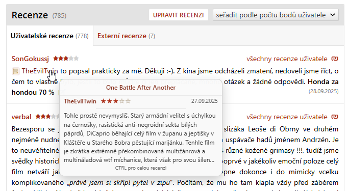
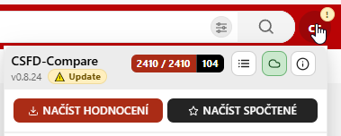

# Changelog

## 0.9.1 - unreleased

### Added

- Notifikace o nové verzi skriptu nad CC menu
- Nový náhled: Odkaz na přímou recenzi na CSFD, včetně hodnocení, data a odkazu na recenzi
  

### Changed

- Lepší notifikace o nové verzi skriptu v CC menu  
  
  
### Development

- Úprava logiky pro zobrazení changelogu po aktualizaci skriptu v dev prostředí
- Zobrazení fotek z images/changelog v dev módu, přes github v release verzi
- Optimalizace kódu, zbavení se duplikátů, atd...
- CHANGELOG.md - předány sekce z minulých releasů
- CHANGELOG.md - opraveny odkazy na github issues (#X)
- Vylepšení README.md pro vývoj, přidány instrukce pro nastavení @require pro Chrome/Opera i Firefox

## 0.9.0 - 2026-03-09

### Added

- Nova samostatna volba `Nahledy externich odkazu` pro zapinani externich hover preview provideru jako AniDB a MyAnimeList.
- Doplneny nove ulozene stranky pro aktualni CSFD strukturu tvurcu a serialu pro presnejsi vyvoj a testovani.

### Changed

- Prejmenovany polozky hover preview v menu na jasnejsi varianty pro `csfd` tvurce, uzivatele a filmy / serialy / epizody.
- Tooltipy informacnich ikon v CC-menu se vykresluji mimo scrollovatelne telo menu, takze zustavaji citelne i u hlavicky a paticky.
- Changelog z GitHubu se po zmene verze nebo po kratke dobe nacita znovu, aby se nove release poznamky propsaly rychleji.

### Fixedd

- Opraveno klikani na info ikony se screenshoty v pripnutem CC-menu otevrenem pres `Ctrl+Alt+C`.
- Opraveno skryvani tooltipu informacnich ikon za pevnou hlavickou a patickou CC-menu.
- Zpresneno rozpoznani inline hodnoceni u vice CSFD kontextu, hlavne u serialovych a odvozenych stranek.

## 0.8.24 - 2026-03-08

### Added

- Hover preview karty pro odkazy na CSFD filmy, tvurce a uzivatele i pro Steam, Wikipedii, AniDB a MyAnimeList.
- Moznost pripnout hover preview klavesou Ctrl, presouvat pripnutou kartu a klikat na odkazy primo v ni.
- Klavesovou zkratku Ctrl+Alt+C pro otevreni menu a novou sekci nastaveni pro hover preview.
- Novy modal po aktualizaci skriptu s prehledem zmen pro novou verzi a plny changelog v informacnim modalu.

### Changed

- Prepracovano menu nastaveni do scrollovatelneho rozlozeni a sjednocena logika hover preview provideru.
- Rozsireny a zkonfigurovany ikony odkazu pro CSFD, YouTube, Steam, Wikipedii, AniDB a MyAnimeList.
- Changelog se nacita z GitHub repozitare a renderuje markdown vcetne obrazku a odkazu.
- Logika zobrazeni novinek si pamatuje posledni potvrzenou verzi a umi zobrazit zmeny znovu i rucne z informacniho okna.

### Fixed

- Opraven konflikt pri ukladani hodnoceni pro ruzne uzivatele stejneho filmu pouzitim klice MovieID-UserSlug.
- Stabilizovano nacitani a zobrazeni hodnoceni, ikon odkazu a hover preview po velkem refaktoru a rozsireni provideru.

## 0.8.23 - 2026-03-07

### Added

- Detailni nahled hodnot v modalnim okne Sprava LocalStorage, vcetne rozbaleni strukturovanych dat.
- Seskupeni cache polozek v LocalStorage a moznost hromadne smazat celou skupinu `cc_creator` cache.

### Changed

- Prepracovan modal Sprava LocalStorage pro lepsi citelnost, vetsi pracovni plochu a prehlednejsi tabulku hodnot.
- Sjednocena znovupouzitelna detailni modal logika pro zobrazovani vnorenych dat v nastaveni.

### Fixed

- Po mazani jednotlivych nebo vsech LocalStorage polozek se znovu synchronizuji prepinace a navazany stav nastaveni.
- Opraveno propisovani navazanych UI aktualizaci po zmenach v LocalStorage, napr. u galerie obrazkovych odkazu a dalsich prvku nastaveni.

## 0.8.22 - 2026-03-05

### Changed

- Prvni vetsi refaktor hover preview provideru a logiky menu.

### Added

- Pridana nova testovaci pokryti pro inline hodnoceni, ikonky odkazu a hover preview controller.

## v0.6.0.3 - 2025-03-29

### Fixed

- Upraven design tlačítek, rozšířen panel

## v0.6.0.2 - 2022-12-28

### Fixed

- Opraveno ukládání správného uživatelského jména do LocalStorage, i když má mezery. Doteď se ukládalo bez mezer.

## v0.6.0.1 - 2022-12-28

### Fixed

- Neukazovalo se tlačítko pro načtení hodnocení

## v0.6.0 - 2022-12-28

Menší vánoční update :-)

### Added

-- Přidána ikona pro IMDb link (tlačítko) u filmů/seriálů ([#18](https://github.com/SonGokussj4/greasyfork-scripts/issues/18))
-- Přidána tlačítka pro `reset nastavení` a `reset přidaných filmů` ([#16](https://github.com/SonGokussj4/greasyfork-scripts/issues/16))
-- V CC menu jsou nyní obrázkové nápovědy v sekci `Film/Seriál`, `Uživatelé` a `Herci` ([#4](https://github.com/SonGokussj4/greasyfork-scripts/issues/4))
-- V diskuzích je nyní možné reagovat na sebe, nejen na ostatní uživatele ([#2](https://github.com/SonGokussj4/greasyfork-scripts/issues/2))
    - OMEZENÍ:
    1) nelze pak reagovat na první příspěvek
    2) nelze reagovat na více "svých" příspěvků najednou
- CC menu je trochu přepracováno, aby šetřilo místo:
    - Snížen padding, je to více na sobě
    - Tlačítko "Načíst hodnocení" bylo zbaveno počtu načtených filmů
    - Počet načtených filmů je nyní zobrazeno v titulku
- Pokud je načteno více filmů, než je shlédnutých, objeví se nabídka, zda přenačíst vše
- Přidáno nové načítání filmů, je to "experimentální", dělá to víc stránek naráz
    - To se pojí s novou databázovou strukturou v LocalStorage, **je třeba přenačíst vše znovu**
- Při ohodnocení nebo odstranění hodnocení se nyní CC menu aktualizuje okamžitě, netřeba refreshovat stránku
- Dočasná vánoční výzdoba

### Fixed

- Ukládání filmů by mělo být stabilnější
- Opraveno pár okrajových případů, kdy script celý spadl
- Opraveno zobrazování nabídky odkazů na obrázky v několika případech
- Csfd opět někde změnilo styl a v případě, kdy byly skryty sekce hlavní stránky bylo CC menu zbytečně široké
- Zobrazení "vypočtených" hodnocení - zobrazí se jako černé hvězdičky - by mělo být stabilnější
- Zobrazování prvků v CC menu pro nepřihlášené uživatele
-- Opraven update dopočítaných hodnocení ([#3](https://github.com/SonGokussj4/greasyfork-scripts/issues/3))

## v0.5.12 - 2022-10-xx

### Added

- Pokud je seriál ohodnocen vypočtením průměrů episod, zobrazí se jako černé hvězdičky
- Přidána kapota nových informací do individuálně uložených dat v Local Storage

### Fixed

- Srovnání hodnocených/uložených hodnocení nyní správně respektuje nová "vypočtené" hodnocení
- Opraveno zobrazování srovnání hodnocení u jiného uživatele

## v0.5.12 - 2022-10-01

### Fixed

-- Domácí stránka: tlačítko "Skrýt" už nepřeskakuje u boxu videa + přídáno u "Partnerem čsfd..."  ([#12](https://github.com/SonGokussj4/greasyfork-scripts/issues/12)) ([#1](https://github.com/SonGokussj4/greasyfork-scripts/issues/1))
-- Galerie tvůrců: zobrazení linků na různé velikosti fotky po přejetí myší, tak jak u galerii filmů ([#10](https://github.com/SonGokussj4/greasyfork-scripts/issues/10))
- Hodnocení: znovu ukazuje % hodnocení i když hodnotilo méně jak 10 lidí
- Hodnocení: znovu ukazuje dodatečné hodnocení jako průměr od oblíbených uživatelů

## v0.5.11.1 - 2021-11-24

### Fixed

- 1-řádkový seznam filmů se nyní zobrazuje stabilněji (jde vidět hodnocení, skoro ve všech případech)

## v0.5.11 - 2021-11-24

### Added

- Boxy na domácí stránce se nyní skrývají tlačítkem "Skrýt" u titulku, zpět zobrazují přes nastavení v CC
- U herců jsou seznamy filmů na 1 řádek. Pokud by film přeskočil na řádek druhý, jsou zobrazeny "..." (experimentální)

## v0.5.10 - 2021-11-10

### Fixed

- Pokud máte zaplé rozšíření csfd-movie-preview, nyní se již nebude zobrazovat náhled cachovaného filmu nad CC
- Opraveno zobrazení ovládacího panelu po přejetí myší, pokud je okno prohlížeče menší jak 635px

## v0.5.9 - 2021-07-20

### Added

- Přidáno zobrazování průměru hodnocení oblíbených uživatelů, pokud nějací hodnotili

### Fixed

- "Datum hodnocení" změněno defaultně jako vypnuté, protože jej zohledňuje CSFD-Extended

## v0.5.8 - 2021-07-20

### Added

- Přidáno zobrazování "Datum hodnocení", protože to čsfd po 2 dnech odebrala

### Fixed

- Opravena funkce 'Zobrazit spočteno ze sérií', už se opět ukazuje pod 'Moje hodnocení'

## v0.5.7 - 2021-07-16

### Added

- Přidáno nastavení pro zobrazování vypočtených % hodnocení, pokud to nehodnotilo ještě 10 uživatelů

## v0.5.6 - 2021-07-14

### Added

- Přidáno nastavení pro zobrazování odkazů na jednotlivé velikosti obrázků v galerii

### Removed

- Odebrána klikatelnost obrázků/plakátů v plné kvalitě, nahrazeno zobrazením odkazů na velikosti
- Odebráno zobrazování "Datum hodnocení", protože to čsfd konečně přidala

## v0.5.5 - 2021-07-13

### Added

- Navrácení klikatelných obrázků/plakátů (v plné kvalitě) v galerii filmů či tvůrce

## v0.5.4 - 2021-07-12

### Added

- Možnost přenačíst všechna hodnocení i po kliknutí na varovnou ikonu v nastavení

### Fixed

- Pokud má uživatel uloženo více hodnocení než existuje, tlačítko obnovení resetuje a obnoví vše
- Duplikace uživatelského hodnocení na stránkách uživatele
- Po najetí kurzorem na verzi už nyní zobrazuje správně changelog
- Pár úprav, které by měly řešit načítání viděných filmů

## v0.5.3 - 2021-07-01

### Added

- Rychlejší obnovení DB, pokud už je částečně načtena
- Tlačítko pro obnovení přesunuto nahoru, zelenou fajfku teď zobrazuje i StarNames

## v0.5.2 - 2021-06-30

### Added

- Přidáno zobrazování hodnocení (hvězd) u viděných filmů/sérií (StarNames obdoba)

## v0.5.0 - 2021-06-27

### Added

- Zcela přepracovaná logika načítání a porovnávání hodnocení (rychlejší)
- U porovnávání hodnocení přejetím myší nad mým hodnocením se zobrazí datum
- Tlačítko pro obnovení hodnocení přesunuto do csfd-compare settings panelu (původně v uživ.)
- Přidáno tlačítko do nastavení: "Přenačíst hodnocení" - zelená fajfka
- Přidáno nastavení: Skrýt panel - Vítej na ČSFD
- Vylepšené zjišťování updatů, nyní jednou za 5 minut, ale info si drží v mezipaměti

### Fixed

- Oprava detekce logovaného uživatele u Greasemonkey
- Oprava skrytí registračního panelu v SK verzi

## v0.4.5 - 2021-06-23

### Added

- Panel nastavení: Přidána sekce "Domácí stránka"
- Přidáno nastavení: Zobrazit datum ohodnocení
- Přidáno nastavení: Zobrazit spočteno ze sérií

### Fixed

- Chyby u načítání hodnocení sérií pro "compare" z vypočtených hodnocení

### Quality

- Nesrovnalost mezi uloženým/reálným počtem hodnocení pro "compare" nyní ukazuje stále

## v0.4.4 - 2021-06-22

### Added

- Zobrazení data ohodnocení filmu/seriálu

### Quality

- Lepší načítání informací o nové verzi. Jen jednou za session

## v0.4.3 - 2021-06-21

### Fixed

- Odebráno nastavení: Skrýt registrační box (čsfd to teď dělá defaultně)

### Added

- Přidáno nastavení: Skrýt panel - Soutěž
- Přidáno nastavení: Skrýt panel - ČSFD sál
- Přidáno nastavení: Skrýt panel - Nové trailery a rozhovory
- Přidáno nastavení: Skrýt panel - Sledujte online / Žhavé DVD tipy
- Upozornění na aktualizaci nyní ukazuje poslední changelog

## v0.4.2 - 2021-06-15

### Added

- Kompatibilita s csfd.sk

## v0.4.1 - 2021-06-14

### Added

- Nově funguje i pro nepřihlášené uživatele (omezeně)
- Nastavení: zobrazit porovnání hodnocení MOJE x UŽIVATEL (v tabulce hodnocení)
- Panel nastavení: přidána verze skriptu

### Fixed

- Zbavení se nepotřebného kódu

## v0.4.0 - 2021-06-14

### Added

- U profilů uživatelů přidáno tlačítko pro zaslání zprávy (místo klikání v ovládacím panelu)
- První nástřel "nastavení", kde si uživatel vybere, co zapne/vypne
- Klikatelné boxy místo tlačítka "VÍCE"
- Tlačítko pro přidání/odebrání z oblíbených na profilu uživatele
- Možnost filtrovat uživatele, jejichž recenze nebudou zobrazeny
- Klikatelný box se zprávou od uživatele místo tlačítka "... více"

## v0.3.5 - 2021-06-08

### Added

- Už žádné vyskakovací okno když nejsou načteny filmy. Nyní jen vykřičník u uživatelského profilu
- Tlačítko pro obnovení hodnocení se objeví jen pokud nesouhlasí počet uložených záznamů v prohlížeči (LocalStorage) vs počet v profilu uživatele

### Fixed

- Zjištění názvu série (předtím fungovalo jen pro filmy, ne jednotlivé série seriálu)
- Při nenačteném hodnocení a navštívení profilu filmu/série, skript zkolaboval
